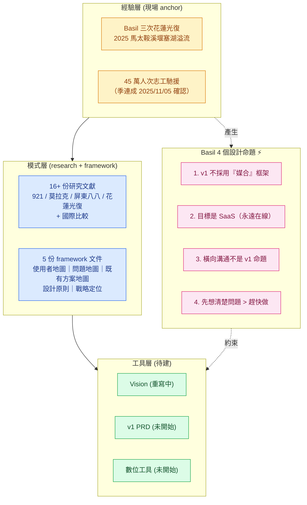
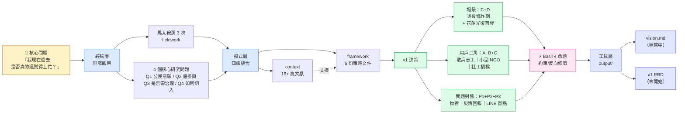
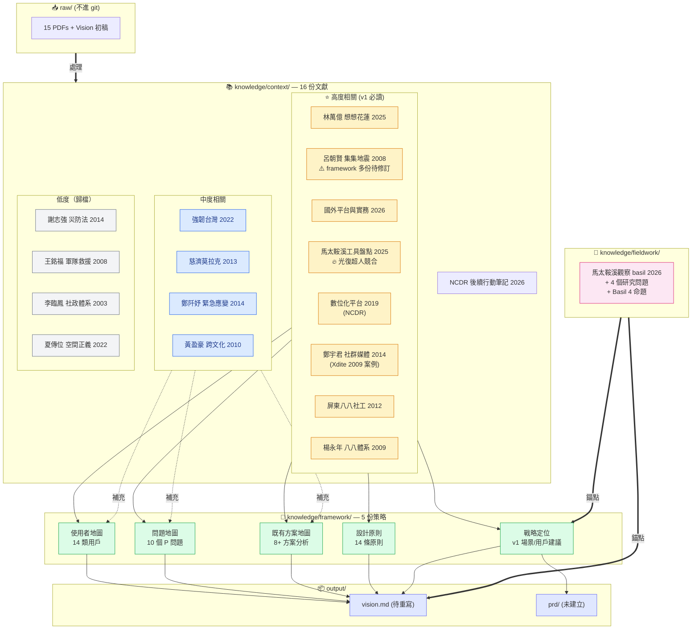
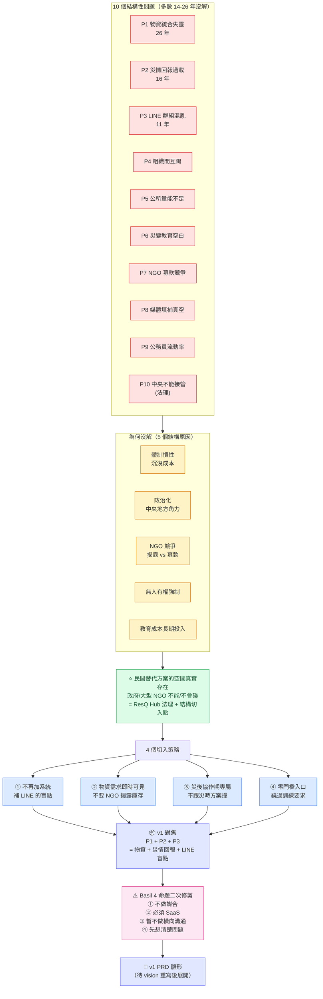
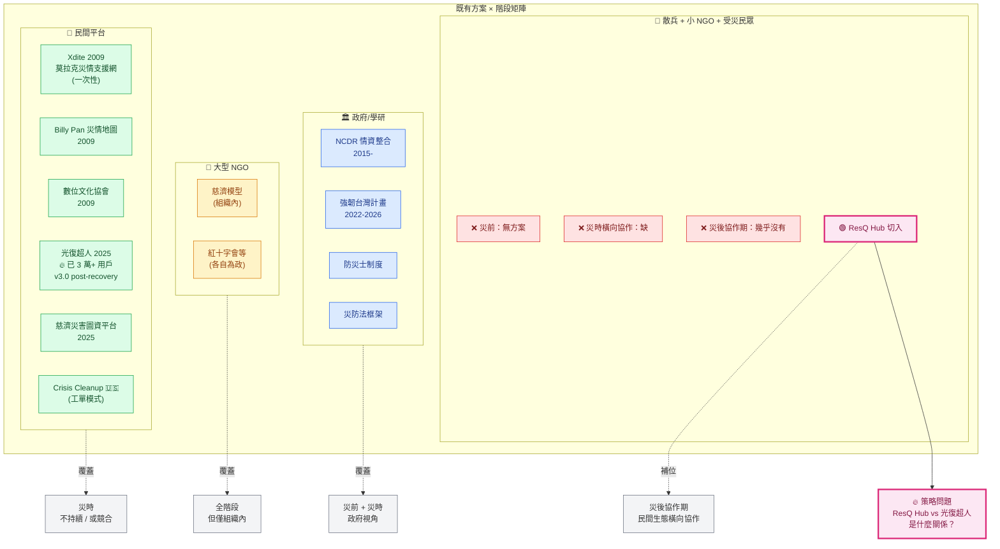
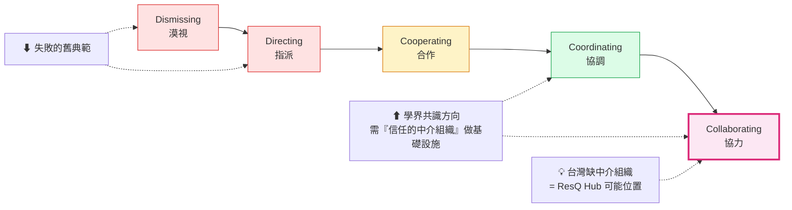

# ResQ Hub 專案視覺化架構

> 目的：一份「看完就能掌握專案脈絡」的視覺地圖。
> 配套：[INDEX.md](INDEX.md)（文字索引）
> 渲染：VS Code 需安裝「Markdown Preview Mermaid Support」擴充；GitHub 與 Obsidian 原生渲染
> 圖中部分節點可點擊跳到原檔（VS Code preview 內 cmd+click，或在 GitHub/Obsidian 上直接點）
> 維護：每次 framework 文件、fieldwork 或 v1 決策有重大變動時同步更新

---

## 0. 一頁總覽 — 整個專案在幹嘛

**讀法**：經驗層是錨點，模式層把它抽象化，工具層是輸出，而 Basil 的 4 個命題像橫梁——直接限制工具層的設計決策。

---

## 1. 專案邏輯架構 — 從現場到工具的推導鏈

**讀法**：左→右是時間/邏輯先後。核心問題（左）是 vision 的真正錨點；Basil 4 命題（中右）會對 v1 決策做最後一次修剪，再進工具層。

---

## 2. 知識庫文件地圖 — 16+ 份文獻怎麼支撐 5 份框架

**讀法**：raw 進來 → context 抽取 → 高度相關文獻直接餵養 5 份 framework → framework + fieldwork 一起產出 vision/PRD。**fieldwork 是 vision 的真正錨點**，不是 framework。

**互動**：以上每個文件節點都可點擊跳到原檔（VS Code preview 內 cmd/ctrl+click；GitHub/Obsidian 直接點）。

---

## 3. 從問題到解方的因果鏈 — 為什麼 ResQ Hub 是這個方向

**讀法**：上→下是推導順序。10 個問題的「為何沒解」反過來定義了民間能切入的空間；4 個切入策略再交叉產生 v1 焦點，最後被 Basil 4 命題二次修剪。

---

## 4. ResQ Hub 與既有方案 — 空白疊圖

### 學界共識方向：command-control → cooperate-coordinate

**讀法**：第一張圖橫向疊四類方案、縱向是階段；唯一沒被任何方案覆蓋的格子是「散兵+小NGO+受災民眾 × 災後協作期」——就是 ResQ Hub 的位置。第二張圖是學界對「應該怎麼對待自發志工」的共識光譜——ResQ Hub 對應的位置是「協調/協力」端。

**互動**：圖 1、3、4 與光譜圖中的關鍵節點都可點擊跳到對應 framework 或 context 文件。

---

## 重要待解問題（按優先級）

| 優先級 | 議題 | 對應位置 |
|---|---|---|
| 🔥🔥🔥 | ResQ Hub vs 光復超人是什麼關係？ | 圖 4 右下「策略問題」 |
| 🔥🔥 | Basil 命題 4「控制/誘因設計」要展開 | 圖 1 中下 |
| 🔥🔥 | Vision 重寫 + North Star 改結果導向 | 圖 1 右下 / 圖 3 末端 |
| 🔥 | framework 依呂朝賢 2008 修訂 | 圖 2 ⭐ 高度相關區 |
| 🔥 | v1 用戶選擇實際決策 | 圖 1 中央 D2 |

---

## 給 Claude 的維護指示

當以下情況發生，更新本檔對應圖：

1. **新文件進 knowledge/** → 圖 2 加節點，標好相關度
2. **framework 重大修訂** → 圖 1、圖 3 對應位置
3. **Basil 決策（v1 場景/用戶/命題展開）** → 圖 1 中央、圖 3 末端
4. **發現新的既有方案** → 圖 4 矩陣
5. **fieldwork 新觀察** → 圖 2 fieldwork 區

本檔的價值在「一張圖看完整個專案」，不要讓任何單張圖膨脹超過 20 個節點——超過就拆。
