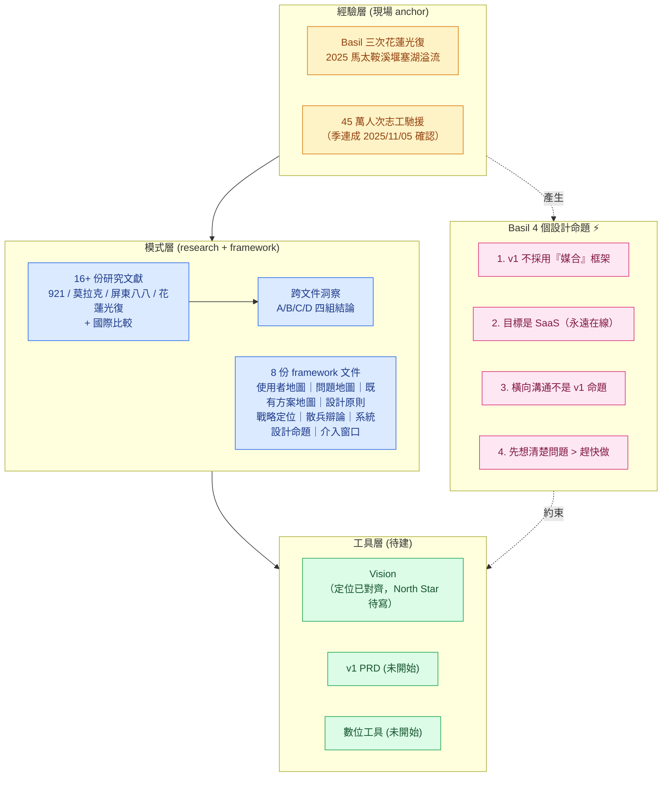
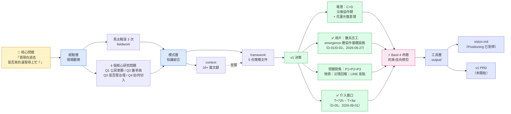
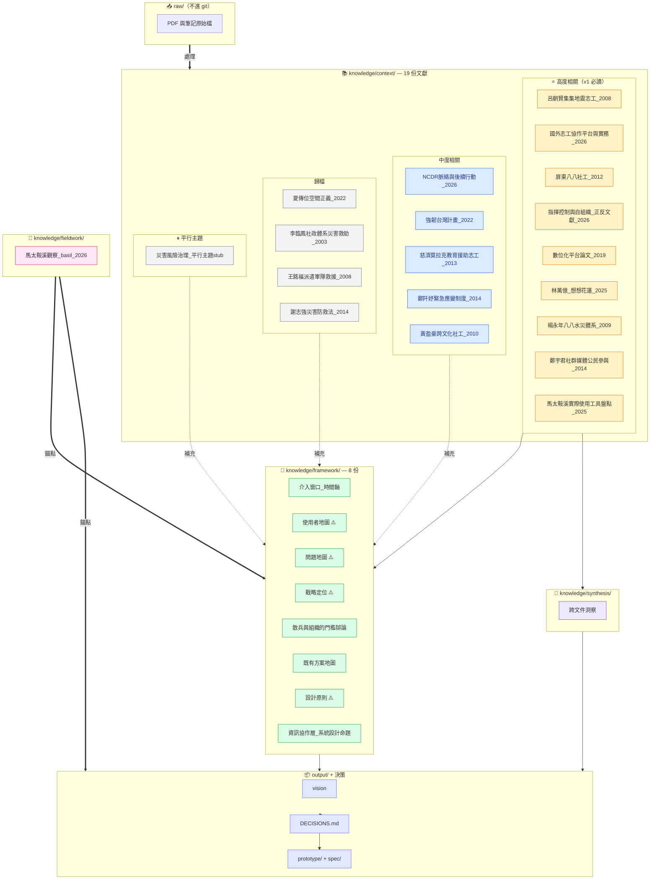
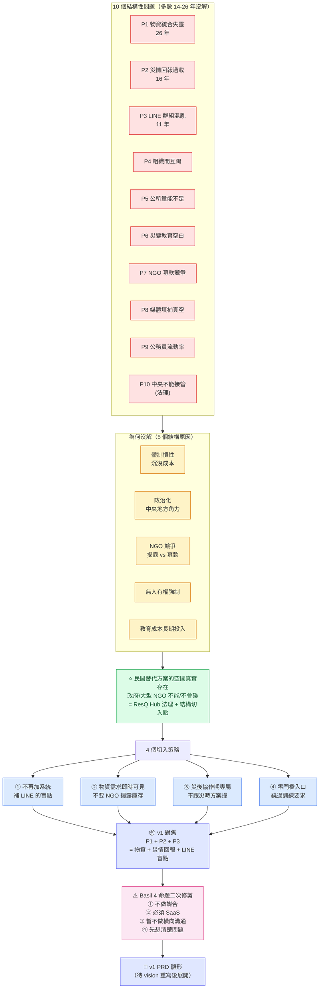
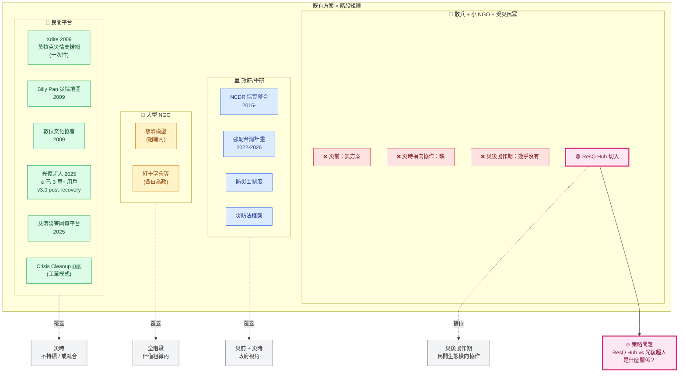
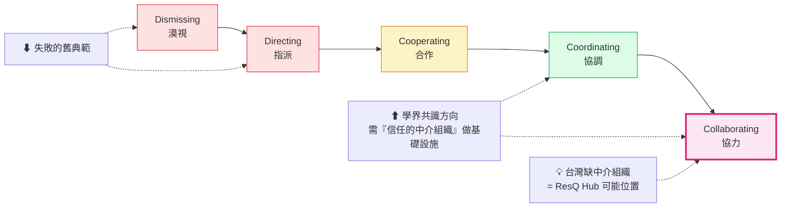

# ResQ Hub 專案視覺化架構

> 目的：一份「看完就能掌握專案脈絡」的視覺地圖。
> 配套：[INDEX.md](INDEX.md)（導覽）｜[DECISIONS.md](DECISIONS.md)（決策與未決）｜[MAP.md](MAP.md)（tag 與關聯查表）
> 渲染：VS Code 需安裝「Markdown Preview Mermaid Support」擴充；GitHub 與 Obsidian 原生渲染
> 圖中部分節點可點擊跳到原檔（VS Code preview 內 cmd+click，或在 GitHub/Obsidian 上直接點）
> 維護：收工流程（`.claude/skills/wrap-up/`）會檢查本檔是否需要同步

---

## 0. 一頁總覽 — 整個專案在幹嘛

```mermaid
flowchart TB
    subgraph EXP["經驗層 (現場 anchor)"]
        F1["Basil 三次花蓮光復<br/>2025 馬太鞍溪堰塞湖溢流"]
        F2["45 萬人次志工馳援<br/>（季連成 2025/11/05 確認）"]
    end

    subgraph MOD["模式層 (research + framework)"]
        R["16+ 份研究文獻<br/>921 / 莫拉克 / 屏東八八 / 花蓮光復<br/>+ 國際比較"]
        FW["8 份 framework 文件<br/>使用者地圖｜問題地圖｜既有方案地圖｜設計原則<br/>戰略定位｜散兵辯論｜系統設計命題｜介入窗口"]
        SY["跨文件洞察<br/>A/B/C/D 四組結論"]
    end

    subgraph TOOL["工具層 (待建)"]
        V["Vision<br/>（定位已對齊，North Star 待寫）"]
        PRD["v1 PRD (未開始)"]
        APP["數位工具 (未開始)"]
    end

    subgraph PROP["Basil 4 個設計命題 ⚡"]
        P1["1. v1 不採用『媒合』框架"]
        P2["2. 目標是 SaaS（永遠在線）"]
        P3["3. 橫向溝通不是 v1 命題"]
        P4["4. 先想清楚問題 > 趕快做"]
    end

    EXP --> MOD
    R --> SY
    MOD --> TOOL
    PROP -.約束.-> TOOL
    EXP -.產生.-> PROP

    classDef exp fill:#fef3c7,stroke:#d97706,color:#92400e
    classDef mod fill:#dbeafe,stroke:#2563eb,color:#1e3a8a
    classDef tool fill:#dcfce7,stroke:#16a34a,color:#14532d
    classDef prop fill:#fce7f3,stroke:#db2777,color:#831843
    class F1,F2 exp
    class R,FW,SY mod
    class V,PRD,APP tool
    class P1,P2,P3,P4 prop
```

**讀法**：經驗層是錨點，模式層把它抽象化，工具層是輸出，而 Basil 的 4 個命題像橫梁——直接限制工具層的設計決策。

---

## 1. 專案邏輯架構 — 從現場到工具的推導鏈

```mermaid
flowchart LR
    A["🎯 核心問題<br/>『我現在過去<br/>是否真的還幫得上忙？』"]

    A --> B["經驗層<br/>現場觀察"]
    B --> B1["馬太鞍溪 3 次<br/>fieldwork"]
    B --> B2["4 個核心研究問題<br/>Q1 公民意願 / Q2 誰參與<br/>Q3 是否需治理 / Q4 如何切入"]

    B1 & B2 --> C["模式層<br/>知識綜合"]
    C --> C1["context<br/>16+ 篇文獻"]
    C --> C2["framework<br/>5 份策略文件"]
    C1 -.支撐.-> C2

    C2 --> D["v1 決策"]
    D --> D1["場景：C+D<br/>災後協作期<br/>+ 花蓮光復首發"]
    D --> D2["✅ 用戶：散兵志工<br/>emergence 層協作基礎設施<br/>（D-01/D-02，2026-06-27）"]
    D --> D3["問題對焦：P1+P2+P3<br/>物資｜災情回報｜LINE 盲點"]

    D --> D4["✅ 介入窗口<br/>T+72h ~ T+3w<br/>（D-05，2026-09-01）"]

    D1 & D2 & D3 & D4 --> E["⚡ Basil 4 命題<br/>約束/反向修剪"]

    E --> F["工具層<br/>output/"]
    F --> F1["vision.md<br/>（Positioning 已對齊）"]
    F --> F2["v1 PRD<br/>（未開始）"]

    classDef anchor fill:#fef3c7,stroke:#d97706
    classDef layer fill:#dbeafe,stroke:#2563eb
    classDef decision fill:#dcfce7,stroke:#16a34a
    classDef constraint fill:#fce7f3,stroke:#db2777
    classDef output fill:#e0e7ff,stroke:#6366f1
    class A anchor
    class B,C layer
    class D,D1,D2,D3,D4 decision
    class E constraint
    class F,F1,F2 output

    click B1 "knowledge/fieldwork/馬太鞍溪觀察_basil_2026.md" "開啟馬太鞍溪觀察"
    click B2 "knowledge/fieldwork/馬太鞍溪觀察_basil_2026.md" "開啟馬太鞍溪觀察（含 4 個研究問題）"
    click C2 "knowledge/framework/戰略定位.md" "開啟戰略定位（5 framework 文件的綜合）"
    click D1 "knowledge/framework/戰略定位.md" "v1 場景建議在戰略定位"
    click D2 "knowledge/framework/散兵與組織的門檻辯論.md" "v1 用戶選擇的收斂辯論"
    click D4 "knowledge/framework/介入窗口_時間軸.md" "介入窗口的定義"
    click D3 "knowledge/framework/問題地圖.md" "P1+P2+P3 問題在問題地圖"
    click E "knowledge/fieldwork/馬太鞍溪觀察_basil_2026.md" "Basil 4 命題在馬太鞍溪觀察第五段"
    click F1 "output/vision.md" "開啟 vision.md"
```

**讀法**：左→右是時間/邏輯先後。核心問題（左）是 vision 的真正錨點；Basil 4 命題（中右）會對 v1 決策做最後一次修剪，再進工具層。

---

## 2. 知識庫文件地圖（自動生成）

<!-- AUTO:kb-map:start -->

```mermaid
flowchart TB
    subgraph RAW["📥 raw/（不進 git）"]
        RP["PDF 與筆記原始檔"]
    end

    subgraph CTX["📚 knowledge/context/ — 19 份文獻"]
        direction TB
        subgraph HIGH["⭐ 高度相關（v1 必讀）"]
            N2["呂朝賢集集地震志工_2008"]
            N3["國外志工協作平台與實務_2026"]
            N5["屏東八八社工_2012"]
            N8["指揮控制與自組織_正反文獻_2026"]
            N9["數位化平台論文_2019"]
            N11["林萬億_想想花蓮_2025"]
            N12["楊永年八八水災體系_2009"]
            N16["鄭宇君社群媒體公民參與_2014"]
            N18["馬太鞍溪實際使用工具盤點_2025"]
        end
        subgraph MID["中度相關"]
            N1["NCDR脈絡與後續行動_2026"]
            N6["強韌台灣計畫_2022"]
            N7["慈濟莫拉克教育援助志工_2013"]
            N17["鄭阡妤緊急應變制度_2014"]
            N19["黃盈豪跨文化社工_2010"]
        end
        subgraph LOW["歸檔"]
            N4["夏傳位空間正義_2022"]
            N10["李臨鳳社政體系災害救助_2003"]
            N14["王銘福派遣軍隊救援_2008"]
            N15["謝志強災害防救法_2014"]
        end
        subgraph PARK["⏸ 平行主題"]
            N13["災害風險治理_平行主題stub"]
        end
    end

    subgraph FW["🧭 knowledge/framework/ — 8 份"]
        N21["介入窗口_時間軸"]
        N22["使用者地圖 ⚠️"]
        N23["問題地圖 ⚠️"]
        N24["戰略定位 ⚠️"]
        N25["散兵與組織的門檻辯論"]
        N26["既有方案地圖"]
        N27["設計原則 ⚠️"]
        N28["資訊協作層_系統設計命題"]
    end

    subgraph FLD["🥾 knowledge/fieldwork/"]
        N20["馬太鞍溪觀察_basil_2026"]
    end

    subgraph SYN["🔬 knowledge/synthesis/"]
        N29["跨文件洞察"]
    end

    subgraph OUT["📦 output/ + 決策"]
        N31["vision"]
        PRD["prototype/ + spec/"]
        DEC["DECISIONS.md"]
    end

    RAW ==>|處理| CTX
    HIGH --> FW
    MID -.補充.-> FW
    LOW -.補充.-> FW
    PARK -.補充.-> FW
    HIGH --> SYN
    SYN --> OUT
    FLD ==>|錨點| FW
    FLD ==>|錨點| OUT
    FW --> OUT
    OUT --> DEC
    DEC --> PRD

    classDef high fill:#fef3c7,stroke:#d97706
    classDef mid fill:#dbeafe,stroke:#2563eb,color:#1e3a8a
    classDef low fill:#f3f4f6,stroke:#6b7280
    classDef fw fill:#dcfce7,stroke:#16a34a
    classDef fld fill:#fce7f3,stroke:#db2777
    classDef syn fill:#ede9fe,stroke:#7c3aed
    classDef out fill:#e0e7ff,stroke:#6366f1
    class N21,N22,N23,N24,N25,N26,N27,N28 fw
    class N20 fld
    class N29 syn
    class N31 out
    class PRD,DEC out
    class N2,N3,N5,N8,N9,N11,N12,N16,N18 high
    class N1,N6,N7,N17,N19 mid
    class N4,N10,N14,N15 low
    class N13 low

    click N1 "knowledge/context/NCDR脈絡與後續行動_2026.md" "開啟原檔"
    click N2 "knowledge/context/呂朝賢集集地震志工_2008.md" "開啟原檔"
    click N3 "knowledge/context/國外志工協作平台與實務_2026.md" "開啟原檔"
    click N4 "knowledge/context/夏傳位空間正義_2022.md" "開啟原檔"
    click N5 "knowledge/context/屏東八八社工_2012.md" "開啟原檔"
    click N6 "knowledge/context/強韌台灣計畫_2022.md" "開啟原檔"
    click N7 "knowledge/context/慈濟莫拉克教育援助志工_2013.md" "開啟原檔"
    click N8 "knowledge/context/指揮控制與自組織_正反文獻_2026.md" "開啟原檔"
    click N9 "knowledge/context/數位化平台論文_2019.md" "開啟原檔"
    click N10 "knowledge/context/李臨鳳社政體系災害救助_2003.md" "開啟原檔"
    click N11 "knowledge/context/林萬億_想想花蓮_2025.md" "開啟原檔"
    click N12 "knowledge/context/楊永年八八水災體系_2009.md" "開啟原檔"
    click N13 "knowledge/context/災害風險治理_平行主題stub.md" "開啟原檔"
    click N14 "knowledge/context/王銘福派遣軍隊救援_2008.md" "開啟原檔"
    click N15 "knowledge/context/謝志強災害防救法_2014.md" "開啟原檔"
    click N16 "knowledge/context/鄭宇君社群媒體公民參與_2014.md" "開啟原檔"
    click N17 "knowledge/context/鄭阡妤緊急應變制度_2014.md" "開啟原檔"
    click N18 "knowledge/context/馬太鞍溪實際使用工具盤點_2025.md" "開啟原檔"
    click N19 "knowledge/context/黃盈豪跨文化社工_2010.md" "開啟原檔"
    click N20 "knowledge/fieldwork/馬太鞍溪觀察_basil_2026.md" "開啟原檔"
    click N21 "knowledge/framework/介入窗口_時間軸.md" "開啟原檔"
    click N22 "knowledge/framework/使用者地圖.md" "開啟原檔"
    click N23 "knowledge/framework/問題地圖.md" "開啟原檔"
    click N24 "knowledge/framework/戰略定位.md" "開啟原檔"
    click N25 "knowledge/framework/散兵與組織的門檻辯論.md" "開啟原檔"
    click N26 "knowledge/framework/既有方案地圖.md" "開啟原檔"
    click N27 "knowledge/framework/設計原則.md" "開啟原檔"
    click N28 "knowledge/framework/資訊協作層_系統設計命題.md" "開啟原檔"
    click N29 "knowledge/synthesis/跨文件洞察.md" "開啟原檔"
    click N30 "knowledge/文獻處理進度.md" "開啟原檔"
    click N31 "output/vision.md" "開啟原檔"
    click DEC "DECISIONS.md" "開啟原檔"
```
<!-- AUTO:kb-map:end -->

**讀法**：raw 進來 → context 抽取 → 高度相關文獻同時餵養 framework 與 synthesis → framework + fieldwork 產出 vision，決策沉澱進 DECISIONS.md 後才進 PRD。**fieldwork 是 vision 的真正錨點**，不是 framework。

framework 內部有一條主脊：**散兵辯論（為什麼）→ 系統設計命題（怎麼運作）→ 介入窗口（何時運作）**。

**互動**：每個文件節點都可點擊跳到原檔（VS Code preview 內 cmd/ctrl+click；GitHub/Obsidian 直接點）。

**這張圖是生成物**——節點清單由 `scripts/kb.py` 從各文件的 `priority` 自動產生，新增文件不用手改圖。
邊只畫粗結構流；⚠️ 標記代表該檔有未處理的 `revision_pending`。**逐條關聯在 [MAP.md](MAP.md)**，畫進圖裡會變毛球。

---

## 3. 從問題到解方的因果鏈 — 為什麼 ResQ Hub 是這個方向

```mermaid
flowchart TB
    subgraph PROBS["10 個結構性問題（多數 14-26 年沒解）"]
        direction LR
        PP1["P1 物資統合失靈<br/>26 年"]
        PP2["P2 災情回報過載<br/>16 年"]
        PP3["P3 LINE 群組混亂<br/>11 年"]
        PP4["P4 組織間互踢"]
        PP5["P5 公所量能不足"]
        PP6["P6 災變教育空白"]
        PP7["P7 NGO 募款競爭"]
        PP8["P8 媒體填補真空"]
        PP9["P9 公務員流動率"]
        PP10["P10 中央不能接管<br/>(法理)"]
    end

    subgraph WHY["為何沒解（5 個結構原因）"]
        W1["體制慣性<br/>沉沒成本"]
        W2["政治化<br/>中央地方角力"]
        W3["NGO 競爭<br/>揭露 vs 募款"]
        W4["無人有權強制"]
        W5["教育成本長期投入"]
    end

    PROBS --> WHY

    WHY --> SPACE["⭐ 民間替代方案的空間真實存在<br/>政府/大型 NGO 不能/不會碰<br/>= ResQ Hub 法理 + 結構切入點"]

    SPACE --> STRAT["4 個切入策略"]
    STRAT --> S1["① 不再加系統<br/>補 LINE 的盲點"]
    STRAT --> S2["② 物資需求即時可見<br/>不要 NGO 揭露庫存"]
    STRAT --> S3["③ 災後協作期專屬<br/>不跟災時方案撞"]
    STRAT --> S4["④ 零門檻入口<br/>繞過訓練要求"]

    S1 & S2 & S3 & S4 --> V1["📦 v1 對焦<br/>P1 + P2 + P3<br/>= 物資 + 災情回報 + LINE 盲點"]

    V1 --> CAUTION["⚠️ Basil 4 命題二次修剪<br/>① 不做媒合<br/>② 必須 SaaS<br/>③ 暫不做橫向溝通<br/>④ 先想清楚問題"]

    CAUTION --> FINAL["🎯 v1 PRD 雛形<br/>（待 vision 重寫後展開）"]

    classDef prob fill:#fee2e2,stroke:#dc2626
    classDef why fill:#fef3c7,stroke:#d97706
    classDef space fill:#dcfce7,stroke:#16a34a,color:#14532d
    classDef strat fill:#dbeafe,stroke:#2563eb
    classDef caution fill:#fce7f3,stroke:#db2777
    classDef final fill:#e0e7ff,stroke:#6366f1
    class PP1,PP2,PP3,PP4,PP5,PP6,PP7,PP8,PP9,PP10 prob
    class W1,W2,W3,W4,W5 why
    class SPACE space
    class S1,S2,S3,S4 strat
    class CAUTION caution
    class FINAL,V1 final

    click PP1 "knowledge/framework/問題地圖.md" "P1 物資統合失靈"
    click PP2 "knowledge/framework/問題地圖.md" "P2 災情回報過載"
    click PP3 "knowledge/framework/問題地圖.md" "P3 LINE 群組混亂"
    click PP4 "knowledge/framework/問題地圖.md" "P4 組織間互踢"
    click PP5 "knowledge/framework/問題地圖.md" "P5 公所量能不足"
    click PP6 "knowledge/framework/問題地圖.md" "P6 災變教育空白"
    click PP7 "knowledge/framework/問題地圖.md" "P7 NGO 募款競爭"
    click PP8 "knowledge/framework/問題地圖.md" "P8 媒體填補真空"
    click PP9 "knowledge/framework/問題地圖.md" "P9 公務員流動率"
    click PP10 "knowledge/framework/問題地圖.md" "P10 中央不能接管"
    click SPACE "knowledge/framework/既有方案地圖.md" "民間切入空間在既有方案地圖"
    click S1 "knowledge/framework/戰略定位.md" "補 LINE 盲點"
    click S2 "knowledge/framework/戰略定位.md" "物資需求即時可見化"
    click S3 "knowledge/framework/戰略定位.md" "災後協作期專屬"
    click S4 "knowledge/framework/戰略定位.md" "零門檻入口"
    click V1 "knowledge/framework/戰略定位.md" "v1 對焦在戰略定位"
    click CAUTION "knowledge/fieldwork/馬太鞍溪觀察_basil_2026.md" "Basil 4 命題在馬太鞍溪觀察"
    click FINAL "output/vision.md" "vision 重寫後展開 v1 PRD"
```

**讀法**：上→下是推導順序。10 個問題的「為何沒解」反過來定義了民間能切入的空間；4 個切入策略再交叉產生 v1 焦點，最後被 Basil 4 命題二次修剪。

---

## 4. ResQ Hub 與既有方案 — 空白疊圖

```mermaid
flowchart TB
    subgraph MATRIX["既有方案 × 階段矩陣"]
        direction TB

        subgraph G["🏛 政府/學研"]
            G1["NCDR 情資整合<br/>2015-"]:::gov
            G2["強韌台灣計畫<br/>2022-2026"]:::gov
            G3["防災士制度"]:::gov
            G4["災防法框架"]:::gov
        end

        subgraph NGO["🤝 大型 NGO"]
            NGO1["慈濟模型<br/>(組織內)"]:::ngo
            NGO2["紅十字會等<br/>(各自為政)"]:::ngo
        end

        subgraph CIV["📡 民間平台"]
            CIV1["Xdite 2009<br/>莫拉克災情支援網<br/>(一次性)"]:::civ
            CIV2["Billy Pan 災情地圖<br/>2009"]:::civ
            CIV3["數位文化協會<br/>2009"]:::civ
            CIV4["光復超人 2025<br/>🔥 已 3 萬+ 用戶<br/>v3.0 post-recovery"]:::civ
            CIV5["慈濟災害圖資平台<br/>2025"]:::civ
            CIV6["Crisis Cleanup 🇺🇸<br/>(工單模式)"]:::civ
        end

        subgraph GAP["🎯 散兵 + 小 NGO + 受災民眾"]
            GAP1["❌ 災前：無方案"]:::gap
            GAP2["❌ 災時橫向協作：缺"]:::gap
            GAP3["❌ 災後協作期：幾乎沒有"]:::gap
            HUB["🟢 ResQ Hub 切入"]:::hub
        end
    end

    G -.覆蓋.-> ST1["災前 + 災時<br/>政府視角"]
    NGO -.覆蓋.-> ST2["全階段<br/>但僅組織內"]
    CIV -.覆蓋.-> ST3["災時<br/>不持續 / 或競合"]
    HUB -.補位.-> ST4["災後協作期<br/>民間生態橫向協作"]

    HUB --> Q["🔥 策略問題<br/>ResQ Hub vs 光復超人<br/>是什麼關係？"]

    classDef gov fill:#dbeafe,stroke:#2563eb,color:#1e3a8a
    classDef ngo fill:#fef3c7,stroke:#d97706,color:#92400e
    classDef civ fill:#dcfce7,stroke:#16a34a,color:#14532d
    classDef gap fill:#fee2e2,stroke:#dc2626,color:#7f1d1d
    classDef hub fill:#fce7f3,stroke:#db2777,color:#831843,stroke-width:3px
    classDef stage fill:#f3f4f6,stroke:#6b7280
    class ST1,ST2,ST3,ST4 stage
    class Q hub

    click G1 "knowledge/context/數位化平台論文_2019.md" "NCDR 計畫詳細分析"
    click G2 "knowledge/context/強韌台灣計畫_2022.md" "強韌台灣計畫整理"
    click G3 "knowledge/context/強韌台灣計畫_2022.md" "防災士制度（屬強韌台灣子計畫）"
    click G4 "knowledge/context/謝志強災害防救法_2014.md" "災防法的法理分析"
    click NGO1 "knowledge/context/慈濟莫拉克教育援助志工_2013.md" "慈濟動員模型"
    click CIV1 "knowledge/context/鄭宇君社群媒體公民參與_2014.md" "Xdite 莫拉克災情支援網案例"
    click CIV2 "knowledge/context/鄭宇君社群媒體公民參與_2014.md" "Billy Pan 災情地圖案例"
    click CIV3 "knowledge/context/鄭宇君社群媒體公民參與_2014.md" "數位文化協會案例"
    click CIV4 "knowledge/context/馬太鞍溪實際使用工具盤點_2025.md" "光復超人現況"
    click CIV5 "knowledge/context/馬太鞍溪實際使用工具盤點_2025.md" "慈濟災害圖資平台"
    click CIV6 "knowledge/context/國外志工協作平台與實務_2026.md" "Crisis Cleanup 工單模式"
    click HUB "knowledge/framework/戰略定位.md" "ResQ Hub 切入點定位"
    click Q "knowledge/context/馬太鞍溪實際使用工具盤點_2025.md" "ResQ Hub vs 光復超人策略問題"
```

### 學界共識方向：command-control → cooperate-coordinate

```mermaid
flowchart LR
    A1["Dismissing<br/>漠視"]:::bad
    A2["Directing<br/>指派"]:::bad
    A3["Cooperating<br/>合作"]:::mid
    A4["Coordinating<br/>協調"]:::good
    A5["Collaborating<br/>協力"]:::best

    A1 --> A2 --> A3 --> A4 --> A5

    OLD["⬇ 失敗的舊典範"] -.-> A1
    OLD -.-> A2
    NEW["⬆ 學界共識方向<br/>需『信任的中介組織』做基礎設施"] -.-> A4
    NEW -.-> A5
    NEW2["💡 台灣缺中介組織<br/>= ResQ Hub 可能位置"] -.-> A5

    classDef bad fill:#fee2e2,stroke:#dc2626
    classDef mid fill:#fef3c7,stroke:#d97706
    classDef good fill:#dcfce7,stroke:#16a34a
    classDef best fill:#fce7f3,stroke:#db2777,stroke-width:3px

    click A1 "knowledge/context/國外志工協作平台與實務_2026.md" "5 級光譜詳述"
    click A2 "knowledge/context/國外志工協作平台與實務_2026.md" "5 級光譜詳述"
    click A3 "knowledge/context/國外志工協作平台與實務_2026.md" "5 級光譜詳述"
    click A4 "knowledge/context/國外志工協作平台與實務_2026.md" "5 級光譜詳述"
    click A5 "knowledge/context/國外志工協作平台與實務_2026.md" "5 級光譜詳述"
    click NEW "knowledge/context/國外志工協作平台與實務_2026.md" "中介組織討論"
    click NEW2 "knowledge/framework/戰略定位.md" "ResQ Hub 在戰略上的位置"
```

**讀法**：第一張圖橫向疊四類方案、縱向是階段；唯一沒被任何方案覆蓋的格子是「散兵+小NGO+受災民眾 × 災後協作期」——就是 ResQ Hub 的位置。第二張圖是學界對「應該怎麼對待自發志工」的共識光譜——ResQ Hub 對應的位置是「協調/協力」端。

**互動**：圖 1、3、4 與光譜圖中的關鍵節點都可點擊跳到對應 framework 或 context 文件。

---

## 待解問題與維護

**待解問題不列在這裡**——單一真相在 [DECISIONS.md](DECISIONS.md)（第二節「未決」按阻塞程度排序）。這裡重複一份只會漂移。

**本檔何時要更新**：新文件進 `knowledge/` → 圖 2；決策變動 → 圖 1、圖 3；發現新的既有方案 → 圖 4；fieldwork 新觀察 → 圖 2。
收工流程（`.claude/skills/wrap-up/`）的「矛盾偵測」步驟會檢查這件事。

**設計約束**：本檔的價值在「一張圖看完整個專案」。
- **圖 0／1／3／4 是概念圖，超過 20 個節點就拆**——它們要能被一眼看懂。
- **圖 2 是知識庫地圖，會隨文獻數線性成長**（目前約 30 個節點），不受此限；但若超過 40 個節點，應把 `archive` 優先度的文獻收成單一節點。
